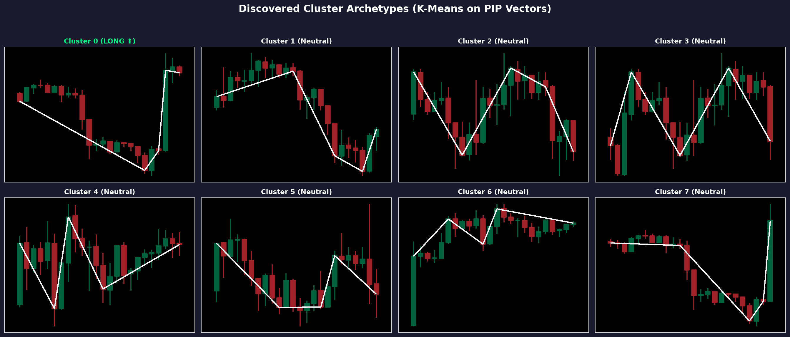
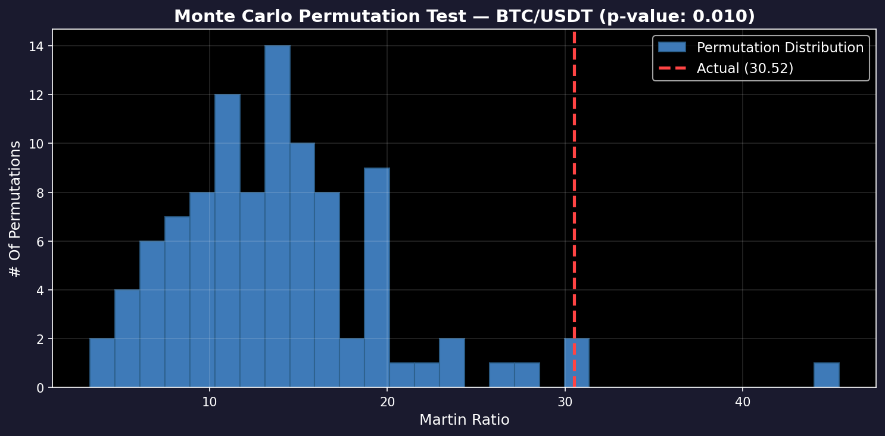
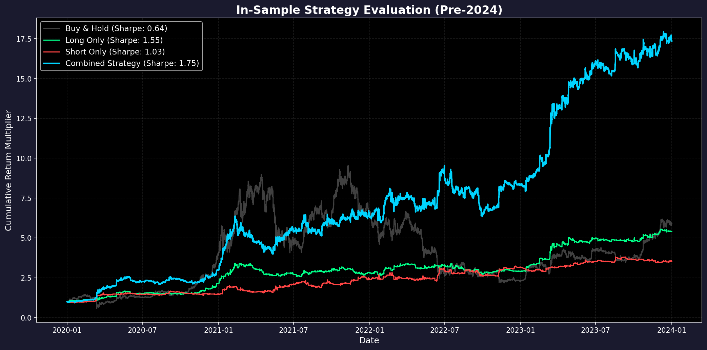
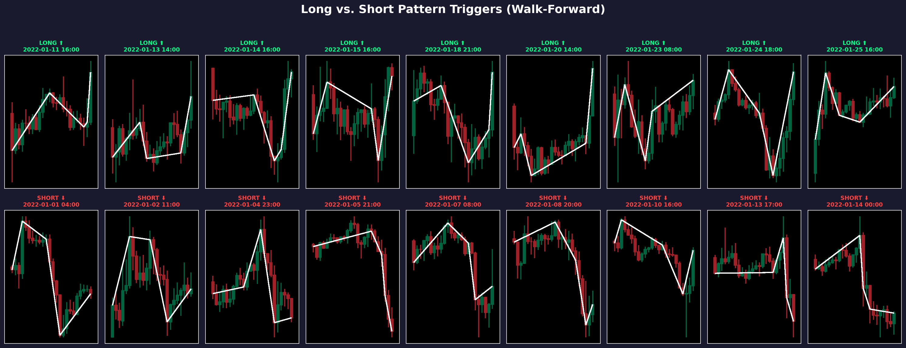
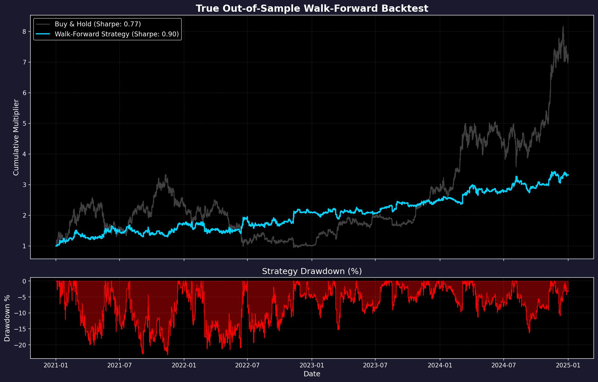

# Cryptocurrency Pattern Mining with Perceptually Important Points (PIPs)

> A data-driven quantitative trading strategy that discovers recurring candlestick patterns in cryptocurrency markets using **Perceptually Important Points**, clusters them via **K-Means**, and validates the edge with a **Monte Carlo Permutation Test**.

---

## Table of Contents

- [Overview](#overview)
- [Pipeline Architecture](#pipeline-architecture)
- [Stage 1 — Data Collection](#stage-1--data-collection)
- [Stage 2 — Perceptually Important Points (PIPs)](#stage-2--perceptually-important-points-pips)
- [Stage 3 — Pattern Clustering with K-Means](#stage-3--pattern-clustering-with-k-means)
- [Stage 4 — Signal Generation & Backtesting](#stage-4--signal-generation--backtesting)
- [Stage 5 — Monte Carlo Permutation Test (MCPT)](#stage-5--monte-carlo-permutation-test-mcpt)
- [Stage 6 — Live Paper Trading](#stage-6--live-paper-trading)
- [Project Structure](#project-structure)
- [Installation & Usage](#installation--usage)
- [Results](#results)
- [References](#references)

---

## Overview

Technical analysis is widely practiced in cryptocurrency markets, yet the subjective nature of chart-pattern recognition limits its reproducibility. This project bridges that gap by automating the entire pattern-discovery pipeline:

1. **Crawl** hourly OHLCV data from the Binance REST API for assets such as BTC/USDT or ETH/USDT.
2. **Extract** the *Perceptually Important Points* (PIPs) of each rolling price window to compress raw candlestick data into a compact polyline that captures the dominant trend structure.
3. **Cluster** the normalized PIP vectors with K-Means (optimal *k* chosen by silhouette search) to discover canonical pattern archetypes.
4. **Assign** each cluster a directional bias (long / short / neutral) based on the forward returns of its member patterns, measured by the Martin Ratio.
5. **Validate** whether the resulting strategy edge is genuine or an artefact of overfitting by running a **Monte Carlo Permutation Test** on 99 synthetic price paths.

---

## Pipeline Architecture

```
Binance API ──► Raw 1h OHLCV ──► Log Prices ──► Sliding Window (24 bars)
                                                        │
                                                        ▼
                                              Perceptually Important Points
                                              (n_pips = 5, dist = Vertical)
                                                        │
                                                        ▼
                                              Z-Score Normalized PIP Vectors
                                                        │
                                                        ▼
                                          Silhouette K-Search  ──►  Optimal k
                                                        │
                                                        ▼
                                              K-Means Clustering
                                                        │
                                           ┌────────────┴────────────┐
                                           ▼                         ▼
                                     Best Long Cluster         Best Short Cluster
                                     (max Martin Ratio)        (min Martin Ratio)
                                           │                         │
                                           └────────────┬────────────┘
                                                        ▼
                                              Combined Long / Short
                                              Trading Strategy
                                                        │
                                           ┌────────────┴────────────┐
                                           ▼                         ▼
                                    Walk-Forward OOS             Monte Carlo
                                      Backtest                Permutation Test
```

---

## Stage 1 — Data Collection

**Script:** [`crawling_data.py`](crawling_data.py)

Historical candlestick data is fetched from the [Binance public REST API](https://binance-docs.github.io/apidocs/) (`GET /api/v3/klines`). The crawler paginates automatically through the `startTime` / `endTime` parameters (limit = 1 000 candles per request) and respects API rate limits with a 100 ms sleep between calls.

| Parameter | Value |
|-----------|-------|
| Symbol | `BTCUSDT` |
| Interval | `1h` (hourly) |
| Date range | 2020-01-01 → 2025-01-01 |
| Output | `BTCUSDT_1h.csv` (~43 800 candles) |

The resulting CSV contains columns: `date`, `open`, `high`, `low`, `close`.

---

## Stage 2 — Perceptually Important Points (PIPs)

**Script:** [`perceptually_important.py`](perceptually_important.py)

### What Are PIPs?

Perceptually Important Points is a time-series compression technique originally introduced for financial data representation. The core idea is that human analysts, when looking at a price chart, perceive only a handful of visually dominant turning points — peaks, troughs, and inflection points — rather than every single tick. PIPs formalise this intuition algorithmically.

### How the Algorithm Works

Given a price window of length *L* and a target count *n* of important points, the algorithm proceeds iteratively:

1. **Initialise** with the two endpoints of the window (the first and last prices). These are always perceptually important because they define the boundaries.

2. **For each subsequent point** (from the 3rd up to the *n*-th):
   - For every adjacent pair of already-selected PIPs, compute the line segment connecting them.
   - For every candidate point *between* each pair, compute a **distance metric** from the candidate to the connecting line segment.
   - Select the candidate with the **maximum distance** across all segments and insert it into the PIP list in sorted order.

3. **Repeat** until exactly *n* PIPs have been identified.

The algorithm supports three distance metrics:

| ID | Metric | Formula |
|----|--------|---------|
| 1 | **Euclidean** | Sum of Euclidean distances to both adjacent PIPs |
| 2 | **Perpendicular** | Shortest perpendicular distance to the line segment between adjacent PIPs |
| 3 | **Vertical** | Absolute vertical distance between the candidate price and the interpolated price on the connecting line |

This project uses **Vertical Distance** (metric 3), which is the most natural measure for price data since the x-axis (time) and y-axis (price) have different units.

### Why PIPs?

- **Dimensionality reduction**: A 24-bar lookback window is compressed to just 5 price values, enabling efficient clustering.
- **Translation & scale invariance**: After Z-score normalisation, the PIP vector captures the *shape* of the price movement regardless of absolute price level or volatility.
- **Noise filtering**: Only the most significant turning points survive, suppressing intra-bar noise.

### Example

For a 24-hour window with `n_pips = 5`, the algorithm identifies 5 dominant turning points. Connecting them with line segments produces a piecewise-linear approximation of the price trend — the "skeleton" of the candlestick pattern.

```
  Price
    │        *  (PIP 3)
    │       / \
    │      /   \        * (PIP 5 = endpoint)
    │     /     \      /
    │    /       \    /
    │   *         \  /
    │  (PIP 2)     *
    │             (PIP 4)
    │
    * (PIP 1 = start)
    └──────────────────────► Time
```

---

## Stage 3 — Pattern Clustering with K-Means

**Script:** [`pip_pattern_miner.py`](pip_pattern_miner.py)

### Unique Pattern Extraction

A sliding window of `lookback = 24` bars advances one bar at a time across the log-price series. At each position the 5-PIP vector is computed. Consecutive windows that share the same internal PIP indices (i.e., the turning points haven't shifted) are deduplicated, retaining only *unique* pattern instances.

Each unique PIP vector is then **Z-score normalised** (zero mean, unit variance) so that patterns of the same *shape* cluster together regardless of whether BTC was trading at \$10 000 or \$60 000.

### Optimal Cluster Count

The number of clusters *k* is **not** hand-picked. Instead, a **Silhouette K-Search** (from `pyclustering`) sweeps *k* ∈ [5, 40] and selects the value that maximises the mean silhouette score — a measure of how cohesive and well-separated the clusters are.

### K-Means Clustering

K-Means++ initialisation followed by Lloyd's algorithm groups the normalised PIP vectors into *k* clusters. Each cluster represents a **canonical pattern archetype** — a family of price movements that share a common shape.

### Cluster → Signal Assignment

For each cluster, a binary signal is constructed: the signal is 1 during the `hold_period = 6` bars following every instance of that cluster, and 0 otherwise. The **Martin Ratio** (return divided by Ulcer Index) of the resulting equity curve is computed. The cluster with the **highest** Martin Ratio is designated the **Long** cluster; the cluster with the **lowest** (most negative) Martin Ratio is designated the **Short** cluster. All other clusters are **neutral** (no trade).

---

## Stage 4 — Signal Generation & Backtesting

### In-Sample Backtest

**Script:** [`IS_backtest.py`](IS_backtest.py)

Trains the miner on pre-2024 data and simulates three portfolios on the same period:

- **Long-Only**: enters only when a long-cluster pattern is detected.
- **Short-Only**: enters only when a short-cluster pattern is detected.
- **Combined**: takes both long and short signals.

Equity curves for all three strategies plus a Buy & Hold benchmark are plotted.

### Walk-Forward Out-of-Sample (OOS) Backtest

**Script:** [`OOS_backtest.py`](OOS_backtest.py)

Implements a rigorous **rolling walk-forward** framework to prevent look-ahead bias:

| Window | Training | Testing |
|--------|----------|---------|
| 1 | 2020–2021 | 2022 |
| 2 | 2021–2022 | 2023 |
| 3 | 2022–2023 | 2024 |

At each step the model is retrained from scratch on the 2-year training window, then evaluated on the subsequent unseen year. The concatenated OOS equity curve and drawdown are plotted.

### Walk-Forward Wrapper

**Script:** [`wf_pip_miner.py`](wf_pip_miner.py)

`WFPIPMiner` wraps `PIPPatternMiner` in an online walk-forward harness. It automatically retrains the model every `step_size` bars (default: 1 year of hourly data) using a rolling `train_size` window (default: 2 years).

### Long / Short Signal Visualisation

**Script:** [`long_short_example.py`](long_short_example.py)

Generates a 2 × 9 grid of candlestick charts with PIP overlay, showing concrete examples of patterns that triggered **Long** (top row) vs. **Short** (bottom row) signals under the walk-forward strategy.

### Cluster Visualisation

**Notebook:** [`mining_patterns.ipynb`](mining_patterns.ipynb)

Trains the miner and saves:
- A **5 × 5 grid** of candlestick exemplars for each of the 16 discovered clusters → [`cluster_visualizations/`](cluster_visualizations/)
- Individual member charts for every pattern instance → [`all_clusters_visualized/`](all_clusters_visualized/)

---

## Stage 5 — Monte Carlo Permutation Test (MCPT)

**Implemented in:** [`pip_pattern_miner.py`](pip_pattern_miner.py) → `PIPPatternMiner.train(arr, n_reps=100)`

### Motivation

A strategy that outperforms on historical data may simply be exploiting random serial correlations in a single price path. The MCPT answers the question: *"Could this strategy have produced an equally strong Martin Ratio on a random price series with the same return distribution?"*

### Procedure

1. **Fit**: Train the miner on the actual log-price series and record the actual Martin Ratio ($M_{\text{actual}}$).

2. **Permute** (repeat 99 times):
   - Compute the vector of first-differences (log-returns) from the actual series.
   - **Randomly shuffle** the returns, destroying any temporal structure (autocorrelation, momentum, patterns) while preserving the marginal distribution.
   - Reconstruct a synthetic cumulative price path from the shuffled returns.
   - Re-run the full pipeline (PIP extraction → silhouette search → K-Means → cluster assignment) on the synthetic path.
   - Record the permutation Martin Ratio ($M_{\text{perm}}^{(i)}$).

3. **p-value**: 

$$p = \frac{ | \{ i : M_{\text{perm}}^{(i)} \geq M_{\text{actual}} \} | }{ N_{\text{perms}} }$$

A small *p*-value (e.g., < 0.10) indicates that the actual strategy's performance is unlikely to be explained by chance alone.

### Results

| Metric | Value |
|--------|-------|
| Actual Martin Ratio | **30.52** |
| Number of Permutations | 99 |
| p-value | **0.010** |

The actual strategy's Martin Ratio of 30.52 exceeds ~99% of the permutation distribution, yielding a p-value of 0.010 — significant at the 1% level, providing strong evidence that the discovered patterns capture genuine structure in BTC/USDT price dynamics.

---

## Stage 6 — Live Paper Trading

**Script:** [`paper_trading.py`](paper_trading.py)

Deploys the trained strategy as a live paper-trading bot via the [Alpaca Markets API](https://alpaca.markets/):

1. On startup, fetches 365 days of hourly BTC/USD data and trains the `PIPPatternMiner`.
2. Enters an infinite loop, waking at the top of each hour.
3. Fetches the latest 24-hour window, computes the PIP vector, and calls `predict()`.
4. If a long or short signal fires, submits a market order for 0.01 BTC and holds for 6 hours.
5. After the hold period expires, closes all positions and resumes scanning.

**Requirements**: An Alpaca paper-trading account with API keys stored in a `.env` file:

```env
ALPACA_PAPER_API_KEY=your_key_here
ALPACA_PAPER_SECRET_KEY=your_secret_here
```

---

## Project Structure

```
DataMining/
│
├── crawling_data.py              # Stage 1: Binance API data crawler
├── perceptually_important.py     # Stage 2: PIP extraction algorithm
├── pip_pattern_miner.py          # Stage 3–5: Core miner (clustering, signals, MCPT)
├── wf_pip_miner.py               # Walk-forward wrapper for online retraining
│
├── IS_backtest.py                # In-sample backtest (pre-2024)
├── OOS_backtest.py               # Walk-forward out-of-sample backtest
├── long_short_example.py         # Visualise long/short signal triggers
├── mining_patterns.ipynb         # Notebook: cluster visualisation & export
├── export_results.py             # Export all pipeline results as images
├── paper_trading.py              # Live paper trading bot (Alpaca API)
│
├── BTCUSDT_1h.csv                # Hourly BTC/USDT data (2020–2025)
├── BTCUSDT_5m.csv                # 5-minute BTC/USDT data (auxiliary)
│
├── PIP.png                       # PIP illustration figure
├── mcpt_test_results.jpeg        # MCPT histogram plot
├── mcpt_test_results.txt         # MCPT numerical results
│
├── results/                      # Exported result images for README
│   ├── pip_miner_mcpt.png        # MCPT histogram
│   ├── cluster_archetypes.png    # Cluster archetype grid
│   ├── IS_backtest_results.png   # In-sample equity curves
│   ├── long_short_results.png    # Long/short trigger examples
│   └── OOS_backtest_results.png  # OOS equity curve + drawdown
│
├── cluster_visualizations/       # 5×5 grid plots for each cluster
├── all_clusters_visualized/      # Individual member plots per cluster
│
└── requirements.txt              # Python dependencies
```

---

## Installation & Usage

### Prerequisites

- Python 3.10+
- pip

### Setup

```bash
# Clone the repository
git clone <repo-url>
cd DataMining

# Create a virtual environment (recommended)
python -m venv .venv
source .venv/bin/activate

# Install dependencies
pip install -r requirements.txt
```

### Running the Pipeline

```bash
# 1. Crawl data from Binance
python crawling_data.py

# 2. Train the miner and run Monte Carlo test (~1 hour)
python pip_pattern_miner.py

# 3. In-sample backtest
python IS_backtest.py

# 4. Walk-forward out-of-sample backtest
python OOS_backtest.py

# 5. Visualise long/short trigger examples
python long_short_example.py

# 6. (Optional) Launch paper trading bot
python paper_trading.py
```

---

## Results

### Pattern Mining & Monte Carlo Validation (`pip_pattern_miner.py`)

The PIP-based miner discovers **unique cluster archetypes** in BTC/USDT hourly data. Each cluster represents a canonical candlestick pattern shape, identified via K-Means clustering on Z-score normalized PIP vectors.

#### Discovered Cluster Archetypes

A representative sample of the discovered clusters, showing one candlestick exemplar per archetype with PIP overlay (white lines). The **Long** and **Short** labels indicate clusters assigned as directional signals based on their Martin Ratio:

<p align="center">
  
</p>

#### Monte Carlo Permutation Test

The MCPT validates that the strategy's edge is genuine and not an artefact of overfitting. The actual strategy's Martin Ratio is compared against 99 permutations with shuffled returns:

<p align="center">
  
</p>

| Metric | Value |
|--------|-------|
| Actual Martin Ratio | **30.52** |
| Number of Permutations | 99 |
| p-value | **0.010** |

The actual strategy's Martin Ratio of 30.52 exceeds ~99% of the permutation distribution, yielding a p-value of 0.010 — **significant at the 1% level**, providing strong evidence that the discovered patterns capture genuine structure in BTC/USDT price dynamics.

---

### In-Sample Backtest (`IS_backtest.py`)

Trained on pre-2024 data, the miner generates long-only, short-only, and combined equity curves:

<p align="center">
  
</p>

| Portfolio | Return | Annualized Sharpe |
|-----------|--------|-------------------|
| **Combined Strategy** | **1635.10%** | **1.75** |
| Long Only | 441.16% | 1.55 |
| Short Only | 250.79% | 1.03 |
| Buy & Hold | 487.23% | 0.64 |

The combined long/short strategy significantly outperforms Buy & Hold on a risk-adjusted basis (Sharpe 1.75 vs 0.64), demonstrating the value of the discovered directional pattern signals.

---

### Long / Short Signal Visualisation (`long_short_example.py`)

Concrete examples of patterns that triggered **Long** (top row) vs. **Short** (bottom row) signals under the walk-forward strategy. Each chart shows a 24-hour candlestick window with PIP overlay:

<p align="center">
  
</p>

---

### Walk-Forward Out-of-Sample Backtest (`OOS_backtest.py`)

The walk-forward OOS backtest uses rolling 2-year training windows to test on unseen 1-year periods:

<p align="center">
  
</p>

#### Per-Window Performance

| Window | Training | Testing | Strategy Return | Benchmark Return | Sharpe |
|--------|----------|---------|-----------------|------------------|--------|
| 1 | 2019–2020 | 2021 | +72.81% | +130.84% | 1.30 |
| 2 | 2020–2021 | 2022 | **+21.23%** | **-56.55%** | 0.47 |
| 3 | 2021–2022 | 2023 | +18.98% | +180.00% | 0.78 |
| 4 | 2022–2023 | 2024 | +32.94% | +152.84% | 1.26 |

#### Aggregate OOS Metrics

| Metric | Strategy | Benchmark |
|--------|----------|-----------|
| **Total Return** | **231.37%** | 610.03% |
| **Annualized Sharpe** | **0.90** | 0.77 |
| **Maximum Drawdown** | **-23.15%** | — |
| Total Trades | 1,591 | — |
| Win Rate | 49.84% | — |

Key takeaway: while Buy & Hold captures more absolute return during strong bull markets, the strategy achieves a **higher Sharpe Ratio (0.90 vs 0.77)** out-of-sample with significantly **lower drawdowns (-23.15%)**. Notably, during the 2022 bear market, the strategy returned **+21.23%** while the benchmark lost **-56.55%**.

---

## References

- Chung, F. L., Fu, T. C., Luk, R., & Ng, V. (2001). *Flexible time series pattern matching based on perceptually important points.* Workshop on Learning from Temporal and Spatial Data, IJCAI.
- White, H. (2000). *A reality check for data snooping.* Econometrica, 68(5), 1097–1126.
- Martin, P. G. & McCann, B. B. (1989). *The Investor's Guide to Fidelity Funds.* (Origin of the Ulcer Index and Martin Ratio.)
